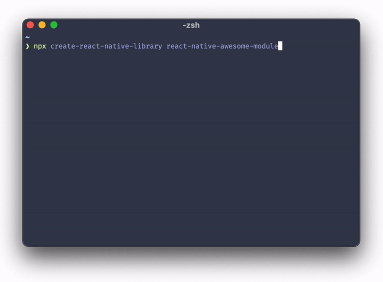

# Bob

[![create-react-native-library][create-react-native-library-version-badge]][create-react-native-library]
[![react-native-builder-bob][react-native-builder-bob-version-badge]][react-native-builder-bob]
[![MIT License][license-badge]][license]

👷‍♂️ Set of CLIs to scaffold and build React Native libraries for different targets.

## Scaffold React Native libraries

If you want to create your own React Native module, scaffolding the project can be a daunting task. `create-react-native-library` can scaffold a new project for you with the following things:

- Minimal boilerplate modules on which you can build upon
- Example React Native app to test your modules
- [TypeScript](https://www.typescriptlang.org/) to ensure type-safe code and better DX
- Support for [Turbo Modules](https://reactnative.dev/docs/next/the-new-architecture/pillars-turbomodules) & [Fabric](https://reactnative.dev/docs/next/the-new-architecture/pillars-fabric-components)
- Support for [Kotlin](https://kotlinlang.org/) on Android & [Swift](https://developer.apple.com/swift/) on iOS
- Support for C++ to write cross-platform native code
- [Expo](https://expo.io/) for libraries without native code and web support
- [ESLint](https://eslint.org/), [Prettier](https://prettier.io/), [TypeScript](https://www.typescriptlang.org/), [Lefthook](https://github.com/evilmartians/lefthook) and [Release It](https://github.com/release-it/release-it) pre-configured
- `react-native-builder-bob` pre-configured to compile your files
- [GitHub Actions](https://github.com/features/actions) pre-configured to run tests and lint on the CI

To create new project, run the following:

```sh
npx create-react-native-library@latest awesome-library
```

This will ask you few questions about your project and generate a new project in a folder named `awesome-library`.



## Build React Native libraries

`react-native-builder-bob` can build code in your React Native library for following targets:

- Generic CommonJS build
- ES modules build for bundlers such as webpack
- Flow definitions (copies .js files to .flow files)
- TypeScript definitions (uses `tsc` to generate declaration files)
- Android AAR files

If you created a project with `create-react-native-library`, `react-native-builder-bob` is already pre-configured to build your project. You don't need to configure it again.

The following configuration steps are for projects not created with `create-react-native-library`.

### Automatic configuration

To automatically configure your project to use `react-native-builder-bob`, open a Terminal and run:

```js
npx react-native-builder-bob@latest init
```

### Manual configuration

To configure your project manually, follow these steps:

1. First, install `react-native-builder-bob` in your project. Open a Terminal in your project, and run:

```sh
yarn add --dev react-native-builder-bob
```

1. In your `package.json`, specify the targets to build for:

   ```json
   "react-native-builder-bob": {
     "source": "src",
     "output": "lib",
     "targets": [
       ["commonjs", {"copyFlow": true}],
       "module",
       "typescript",
     ]
   }
   ```

   See options below for more details.

1. Add `bob` to your `prepare` step:

   ```js
   "scripts": {
     "prepare": "bob build"
   }
   ```

1. Configure the appropriate entry points:

   ```json
   "main": "lib/commonjs/index.js",
   "module": "lib/module/index.js",
   "react-native": "src/index.ts",
   "types": "lib/typescript/index.d.ts",
   "files": [
     "lib/",
     "src/"
   ]
   ```

   Make sure to change specify correct files according to the targets you have enabled.

   It's usually good to point to your source code with the `react-native` field to make debugging easier. Metro already supports compiling a lot of new syntaxes including JSX, Flow and TypeScript and it will use this field if present.

   If you're building TypeScript definition files, also make sure that the `types` field points to a correct path. Depending on the project configuration, the path can be different for you than the example snippet (e.g. `lib/typescript/index.d.ts` if you have only the `src` directory).

1. Add the output directory to `.gitignore` and `.eslintignore`

   ```gitignore
   # generated files by bob
   lib/
   ```

1. Add the output directory to `jest.modulePathIgnorePatterns` if you use [Jest](https://jestjs.io)

   ```json
   "modulePathIgnorePatterns": ["<rootDir>/lib/"]
   ```

And we're done 🎉

### Options

The options can be specified in the `package.json` file under the `react-native-builder-bob` property, or in a `bob.config.js` file in your project directory.

#### `source`

The name of the folder with the source code which should be compiled. The folder should include an `index` file.

#### `output`

The name of the folder where the compiled files should be output to. It will contain separate folder for each target.

#### `targets`

Various targets to build for. The available targets are:

##### `commonjs`

Enable compiling source files with Babel and use commonjs module system.

This is useful for running the code in Node (SSR, tests etc.). The output file should be referenced in the `main` field of `package.json`.

By default, the code is compiled to support last 2 versions of modern browsers. It also strips TypeScript and Flow annotations, and compiles JSX. You can customize the environments to compile for by using a [browserslist config](https://github.com/browserslist/browserslist#config-file).

In addition, the following options are supported:

- `configFile` & `babelrc` (`boolean`): To customize the babel config used, you can pass the [`configFile`](https://babeljs.io/docs/en/options#configfile) option as `true` if you have a `babel.config.js` or [`babelrc`](https://babeljs.io/docs/en/options#babelrc) option if you have a `.babelrc`. This may break the default configuration, so use these options only if you know what you're doing.

- `copyFlow` (`boolean`): If your source code is written in [Flow](http://www.typescriptlang.org/), You can specify the `copyFlow` option to copy the source files as `.js.flow` to the output folder. If the `main` entry in `package.json` points to the `index` file in the output folder, the flow type checker will pick these files up to use for type definitions.

- `sourceMaps` (`boolean`): Sourcemaps are generated by default alongside the compiled files. You can disable them by setting the `sourceMaps` option to `false`.

Example:

```json
["commonjs", { "configFile": true, "copyFlow": true }]
```

##### `module`

Enable compiling source files with Babel and use ES module system. This is essentially same as the `commonjs` target and accepts the same options, but leaves the `import`/`export` statements in your code.

This is useful for bundlers which understand ES modules and can tree-shake. The output file should be referenced in the `module` field of `package.json`.

Example:

```json
["module", { "configFile": true }]
```

##### `typescript`

Enable generating type definitions with `tsc` if your source code is written in [TypeScript](http://www.typescriptlang.org/).

The following options are supported:

- `project` (`string`): By default, the `tsconfig.json` file in the root of your project is used to generate the type definitions. You can specify a path to a different config by using the `project` option. This can be useful if you need to use different configs for development and production.

- `tsc` (`string`): The path to the `tsc` binary is automatically detected and defaults to the one installed in your project. You can use the `tsc` option to specify a different path.

Example:

```json
["typescript", { "project": "tsconfig.build.json" }]
```

##### `aar`

Enable assembling Android AAR files for a library for React Native modules including native code.

The following options are supported:

- `reverseJetify` (`boolean`): If your package is using [AndroidX](https://developer.android.com/jetpack/androidx), it's possible to convert the AAR with the `reverseJetify` option to use the [Android support Library](https://developer.android.com/topic/libraries/support-library) using the [`jetifier`](https://www.npmjs.com/package/jetifier) package. This is useful to publish packages for older projects which haven't migrated to AndroidX.

- `androidPath` (`string`): You can specify a custom path to the `android` directory if it's not in the default location (`android` in the root of your project).

- `androidBundleName`: By default, the generated `aar` file is named as `android.aar`. You can specify a custom name using this option.

Example:

```json
["aar", { "reverseJetify": true }]
```

### Commands

The `bob` CLI exposes the following commands:

#### `init`

This configures an existing project to use `bob` by adding the required configuration and dependencies. This is usually run with `npx`:

```sh
npx react-native-builder-bob@latest init
```

#### `build`

This builds the project according to the configuration. This is usually run as part of the package's publishing flow, i.e. in the `prepare` or `prepack` scripts.

```json
"scripts": {
  "prepare": "bob build"
}
```

## FAQ

### Why should I compile my project with `react-native-builder-bob`?

We write our library code in non-standard syntaxes such as JSX, TypeScript etc. as well as proposed syntaxes which aren't part of the standard yet. This means that our code needs to be compiled to be able to run on JavaScript engines.

When using the library in a React Native app, Metro handles compiling the source code. However, it's also possible to use them in other targets such as web, run in Node for tests or SSR etc. So we need to compile the source code for them as well.

Currently, to handle such multiple targets, we need to have multiple babel configs and write a long `babel-cli` command in our `package.json`. We also need to keep the configs in sync between our projects.

Just as an example, this is a command we have in one of the packages: `babel --extensions '.js,.ts,.tsx' --no-babelrc --config-file=./babel.config.publish.js src --ignore '**/__tests__/**' --copy-files --source-maps --delete-dir-on-start --out-dir dist && del-cli 'dist/**/__tests__' && yarn tsc --emitDeclarationOnly`. This isn't all, there's even a separate `babel.config.publish.js` file. And this only works for webpack and Metro, and will fail on Node due to ESM usage.

`react-native-builder-bob` wraps tools such as `babel` and `typescript` to simplify these common tasks across multiple projects. It's tailored specifically to React Native projects to minimize the configuration required.

### How do I add a react-native library containing native code as a dependency in my library?

If your library depends on another react-native library containing native code, you should do the following:

- **Add the native library to `peerDependencies`**

  This means that the user will need to install the native library and add it to their `package.json`. It makes sure that:

  - There are no version conflicts if another package also happens to use the same library, or if the user wants to use the library in their app. While there can be multiple versions of a JavaScript-only library, there can only be one version of a native library - so avoiding version conflicts is important.
  - The package manager installs it in correct location so that autolinking can work properly.

  Don't add the native library to `dependencies`, otherwise it may cause issues for the user even if it seems to work.

- **Add the native library to `devDependencies`**

  This makes sure that you can use it for tests, and there are no other errors such as type errors due to the missing module.

- **Add the native library to `dependencies` in the `package.json` under `example`**

  This is equivalent to the consumer of the library installing the dependency, and is needed so that this module is also available to the example app.

### How to upgrade the `react-native` version in the generated project?

Since this is a library, the `react-native` version specified in the `package.json` is not relevant for the consumers. It's only used for developing and testing the library. If you'd like to upgrade the `react-native` version to test with it, you'd need to:

1. Bump versions of the following packages under `devDependencies` in the `package.json`:

   - `react-native`
   - `react`
   - `@types/react`
   - `@types/react-native`

   If you have any other related packages such as `react-test-renderer`, make sure to bump them as well.

2. Upgrade `react-native` in the `example` app.

   The example app is a React Native app that can be updated following the same process as a regular React Native app. The process will vary depending on if it's using [Expo](https://expo.io) or [React Native CLI](https://github.com/react-native-community/cli). See the [official upgrade guide](https://reactnative.dev/docs/upgrading) for more details.

To avoid issues, make sure that the versions of `react` and `react-native` are the same in `example/package.json` and the `package.json` at the root.

### How does the library get linked to the example app in the generated project?

If you generate a project with `create-react-native-library`, you get an example app to test your library. It's good to understand how the library gets linked to the example app in case you want to tweak how it works or if you run into issues.

There are 2 parts to this process.

1. **Aliasing the JavaScript code**

   The JavaScript (or TypeScript) source code is aliased to be used by the example app. This makes it so that when you import from `'your-library-name'`, it imports the source code directly and avoids having to rebuild the library for JavaScript only changes. We configure several tools to make this work:

   - [Babel](https://babeljs.io) is configured to use the alias in `example/babel.config.js` using [babel-plugin-module-resolver](https://github.com/tleunen/babel-plugin-module-resolver). This transforms the imports to point to the source code instead.
   - [Metro](https://facebook.github.io/metro/) is configured to allow importing from outside of the `example` directory by configuring `watchFolders`, and to use the appropriate peer dependencies. This configuration exists in the `example/metro.config.js` file.
   - [Webpack](https://webpack.js.org/) is configured to compile the library source code when running on the Web. This configuration exists in the `example/webpack.config.js` file.
   - [TypeScript](https://www.typescriptlang.org/) is configured to use the source code for type checking by using the `paths` property under `compilerOptions`. This configuration exists in the `tsconfig.json` file at the root.

2. **Linking the native code**

   By default, React Native CLI only links the modules installed under `node_module` of the app. To be able to link the `android` and `ios` folders from the project root, the path is specified in the `example/react-native.config.js` file.

### How to test the library in an app locally?

You may have come across the `yarn link` and `npm link` commands to test libraries locally. These commands work great for simple packages without build process, but they have different behavior from how a published package works.

For more accurate testing, we recommend following approaches:

1. **Local tarball with `npm`**

   First, temporarily change the version in `package.json` to something like `0.0.0-local.0`. This version number needs to be updated to something different every time you do this to avoid [stale content](https://github.com/yarnpkg/yarn/issues/6811).

   Run the following command inside your library's root:

   ```sh
   npm pack
   ```

   This will generate a file like `your-library-name-0.0.0-local.0.tgz` in the root of the project.

   Then, you can install the tarball in your app:

   ```sh
   yarn add ../path/to/your-library-name-0.0.0-local.0.tgz
   ```

   Or if you use `npm`:

   ```sh
   npm install ../path/to/your-library-name-0.0.0-local.0.tgz
   ```

2. **Verdaccio**

   [Verdaccio](https://verdaccio.org/) is a lightweight private npm registry that can be used to test packages locally. The advantage of using Verdaccio is that it allows to test the complete workflow of publishing and installing a package without actually publishing it to a remote registry.

   You can find installation and usage instructions in the [Verdaccio documentation](https://verdaccio.org/docs/en/installation).

## Development workflow

This project uses a monorepo using `yarn`. To setup the project, run `yarn` in the root directory to install the required dependencies.

```sh
yarn
```

While developing, you can run watch mode to automatically rebuild the changes:

```sh
yarn watch
```

To test the CLI locally, you can point to the `bin/bob` executable:

```sh
../bob/packages/create-react-native-library/bin/create-react-native-library
```

Before sending a pull request, make sure your code passes TypeScript and ESLint. Run the following to verify:

```sh
yarn typecheck
yarn lint
```

To fix formatting errors, run the following:

```sh
yarn lint --fix
```

## Acknowledgements

Thanks to the authors of these libraries for inspiration:

- [create-react-native-module](https://github.com/brodybits/create-react-native-module)
- [react-native-webview](https://github.com/react-native-community/react-native-webview)
- [RNNewArchitectureLibraries](https://github.com/react-native-community/RNNewArchitectureLibraries)

## Alternatives

There are other similar tools to scaffold React Native libraries. The difference is that the generated project with `create-react-native-library` is very opinionated and configured with additional tools.

- [react-native-module-init](https://github.com/brodybits/react-native-module-init)

## LICENSE

MIT

<!-- badges -->

[create-react-native-library-version-badge]: https://img.shields.io/npm/v/create-react-native-library?label=create-react-native-library&style=flat-square
[react-native-builder-bob-version-badge]: https://img.shields.io/npm/v/react-native-builder-bob?label=react-native-builder-bob&style=flat-square
[create-react-native-library]: https://www.npmjs.com/package/create-react-native-library
[react-native-builder-bob]: https://www.npmjs.com/package/react-native-builder-bob
[license-badge]: https://img.shields.io/npm/l/react-native-builder-bob.svg?style=flat-square
[license]: https://opensource.org/licenses/MIT
