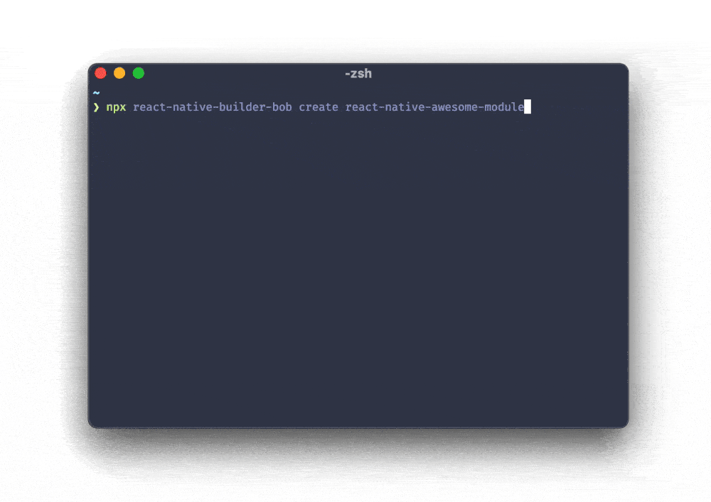

# react-native-builder-bob

[![Version][version-badge]][package]
[![Build Status][build-badge]][build]
[![MIT License][license-badge]][license]

👷‍♂️ Simple CLI to scaffold and build React Native libraries for different targets.

## Features

### Scaffold new projects

If you want to create your own React Native module, scaffolding the project can be a daunting task. Bob can scaffold a new project for you with the following things:

- Simple example modules for Android and iOS which you can build upon
- [Kotlin](https://kotlinlang.org/) configured for building the module on Android
- C++ support for native modules on Android and iOS
- [Expo](https://expo.io/) support for libraries without native code and web support
- Example React Native app to manually test your modules
- [ESLint](https://eslint.org/), [Prettier](https://prettier.io/), [TypeScript](https://www.typescriptlang.org/), [Husky](https://github.com/typicode/husky) and [Release It](https://github.com/release-it/release-it) pre-configured
- Bob pre-configured to compile your files
- [CircleCI](https://circleci.com/) pre-configured to run tests on the CI



### Build your projects

Bob can build code for following targets:

- Generic CommonJS build
- ES modules build for bundlers such as webpack
- Flow definitions (copies .js files to .flow files)
- TypeScript definitions (uses `tsc` to generate declaration files)
- Android AAR files

## Usage

### Creating a new project

To create new project with Bob, run the following:

```sh
npx react-native-builder-bob create react-native-awesome-module
```

This will ask you few questions about your project and generate a new project in a folder named `react-native-awesome-module`.

The difference from [create-react-native-module](https://github.com/brodybits/create-react-native-module) is that the generated project with Bob is very opinionated and configured with additional tools.

### Configuring an existing project

#### Automatic configuration

To automatically configure your project to use Bob, open a Terminal and run:

```js
npx react-native-builder-bob init
```

#### Manual configuration

To configure your project manually, follow these steps:

1. First, install Bob in your project. Open a Terminal in your project, and run:

  ```sh
  yarn add --dev react-native-builder-bob
  ```

1. In your `package.json`, specify the targets to build for:

   ```json
   "react-native-builder-bob": {
     "source": "src",
     "output": "lib",
     "targets": [
       ["aar", {"reverseJetify": true}],
       ["commonjs", {"copyFlow": true}],
       "module",
       "typescript",
     ]
   }
   ```

   See options below for more details.

1. Add `bob` to your `prepare` step:

   ```js
   "scripts": {
     "prepare": "bob build"
   }
   ```

1. Configure the appropriate entry points:

   ```json
   "main": "lib/commonjs/index.js",
   "module": "lib/module/index.js",
   "react-native": "src/index.ts",
   "types": "lib/typescript/src/index.d.ts",
   "files": [
     "lib/",
     "src/"
   ]
   ```

   Make sure to change specify correct files according to the targets you have enabled.

   It's usually good to point to your source code with the `react-native` field to make debugging easier. Metro already supports compiling a lot of new syntaxes including JSX, Flow and TypeScript and it will use this field if present.

   If you're building TypeScript definition files, also make sure that the `types` field points to a correct path. Depending on the project configuration, the path can be different for you than the example snippet (e.g. `lib/typescript/index.d.ts` if you have only the `src` directory).

1. Add the output directory to `.gitignore` and `.eslintignore`

   ```gitignore
   # generated files by bob
   lib/
   ```

1. Add the output directory to `jest.modulePathIgnorePatterns` if you use [Jest](https://jestjs.io)

   ```json
   "modulePathIgnorePatterns": ["<rootDir>/lib/"]
   ```

And we're done 🎉

## Options

The options can be specified in the `package.json` file under the `react-native-builder-bob` property, or in a `bob.config.js` file in your project directory.

### `source`

The name of the folder with the source code which should be compiled. The folder should include an `index` file.

### `output`

The name of the folder where the compiled files should be output to. It will contain separate folder for each target.

### `targets`

Various targets to build for. The available targets are:

#### `commonjs`

Enable compiling source files with Babel and use commonjs module system.

This is useful for running the code in Node (SSR, tests etc.). The output file should be referenced in the `main` field of `package.json`.

By default, this will compile the code for last 2 versions of modern browsers, as well as JSX. It'll also strip TypeScript and Flow annotations. You can customize the environments to compile for by using a [browserslist config](https://github.com/browserslist/browserslist#config-file). To customize the babel config used, you can pass the [`configFile`](https://babeljs.io/docs/en/options#configfile) or [`babelrc`](https://babeljs.io/docs/en/options#babelrc) options.

If your source code is written in [Flow](http://www.typescriptlang.org/), You can also specify the `copyFlow` option to copy the source files as `.js.flow` to the output folder. If the `main` entry in `package.json` points to the `index` file in the output folder, the flow type checker will pick these files up to use for type definitions.

Example:

```json
["commonjs", { "babelrc": true, "copyFlow": true }]
```

#### `module`

Enable compiling source files with Babel and use ES module system. This is essentially same as the `commonjs` target and accepts the same options, but leaves the `import`/`export` statements in your code.

This is useful for bundlers which understand ES modules and can tree-shake. The output file should be referenced in the `module` field of `package.json`.

Example:

```json
["module", { "babelrc": true, "copyFlow": true }]
```

#### `typescript`

Enable generating type definitions with `tsc` if your source code is written in [TypeScript](http://www.typescriptlang.org/).

By default, it'll use the `tsconfig.json` file in your project root. If you want to use a different config, you can specify it using the `project` option. Furthermore, the tsc binary will be resolved to ./node_modules/.bin/tsc. Use the `tsc` option to specify a different path.

Example:

```json
["typescript", { "project": "tsconfig.build.json" }]
```

#### `aar`

Enable assembling Android AAR files for a library for React Native modules including native code.

It's also possible to convert the AAR with the `reverseJetify` option to use the [Android support Library](https://developer.android.com/topic/libraries/support-library) using the [`jetifier`](https://www.npmjs.com/package/jetifier) package if your package is using [AndroidX](https://developer.android.com/jetpack/androidx). This is useful to publish packages for older projects which haven't migrated to AndroidX.

You can also specify the `androidPath` (defaults to `android`) to specify the `android` directory and `androidBundleName` (defaults to `android.aar`) to customize the name of AAR file.
Example:

```json
["aar", { "reverseJetify": true }]
```

## FAQ

## Why should I compile my project with Bob?

We write our library code in non-standard syntaxes such as JSX, TypeScript etc. as well as proposed syntaxes which aren't part of the standard yet. This means that our code needs to be compiled to be able to run on JavaScript engines.

When using the library in a React Native app, Metro handles compiling the source code. However, it's also possible to use them in other targets such as web, run in Node for tests or SSR etc. So we need to compile the source code for them as well.

Currently, to handle such multiple targets, we need to have multiple babel configs and write a long `babel-cli` command in our `package.json`. We also need to keep the configs in sync between our projects.

Just as an example, this is a command we have in one of the packages: `babel --extensions '.js,.ts,.tsx' --no-babelrc --config-file=./babel.config.publish.js src --ignore '**/__tests__/**' --copy-files --source-maps --delete-dir-on-start --out-dir dist && del-cli 'dist/**/__tests__' && yarn tsc --emitDeclarationOnly`. This isn't all, there's even a separate `babel.config.publish.js` file. And this only works for webpack and Metro, and will fail on Node due to ESM usage.

Bob wraps tools such as `babel` and `typescript` to simplify these common tasks across multiple projects. It's tailored specifically to React Native projects to minimize the configuration required.

### How do I add a react-native library containing native code as a dependency in my library?

If your library depends on another react-native library containing native code, you should do the following:

- Add the native library to `peerDependencies`: This makes sure that there are no conflicts between the version you have specified and the version user has installed (in case they also want to use that library). By deferring the installation to the user, it also makes sure the package manager installs it in correct location and that autolinking can work properly.
- Add the native library to `devDependencies`: This makes sure that you can use it for tests, and there are no other errors such as type errors due to the missing module.
- Add the native library to `dependencies` under `example`: This is equivalent to the consumer of the library installing the dependency, and is needed so that this module is also available to the example app.

## Development workflow

To get started with the project, run `yarn` in the root directory to install the required dependencies.

```sh
yarn
```

While developing, you can run watch mode to automatically rebuild the changes:

```sh
yarn watch
```

To test the CLI locally, you can point to the `bin/bob` executable:

```sh
../bob/bin/bob create test-project
```

Before sending a pull rquest, make sure your code passes TypeScript and ESLint. Run the following to verify:

```sh
yarn typescript
yarn lint
```

To fix formatting errors, run the following:

```sh
yarn lint --fix
```

## Acknowledgements

Thanks to the authors of these libraries for inspiration:

- [create-react-native-module](https://github.com/brodybits/create-react-native-module)
- [react-native-webview](https://github.com/react-native-community/react-native-webview)

## LICENSE

MIT

<!-- badges -->

[version-badge]: https://img.shields.io/npm/v/react-native-builder-bob.svg?style=flat-square
[package]: https://www.npmjs.com/package/react-native-builder-bob
[build-badge]: https://img.shields.io/circleci/project/github/callstack/react-native-builder-bob/main.svg?style=flat-square
[build]: https://circleci.com/gh/callstack/react-native-builder-bob
[license-badge]: https://img.shields.io/npm/l/react-native-builder-bob.svg?style=flat-square
[license]: https://opensource.org/licenses/MIT
